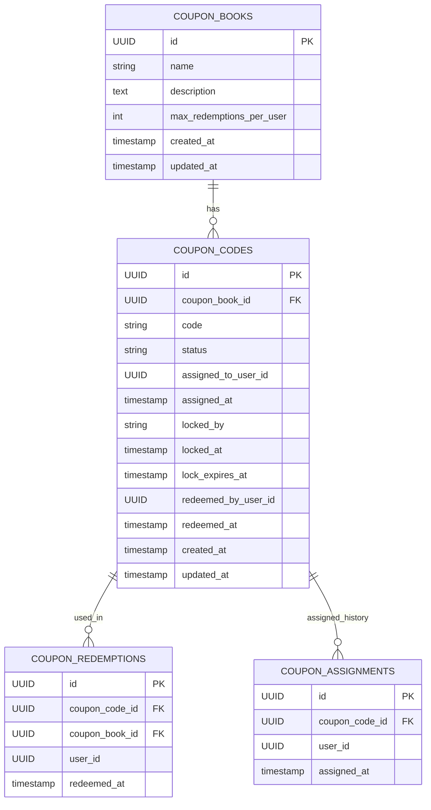
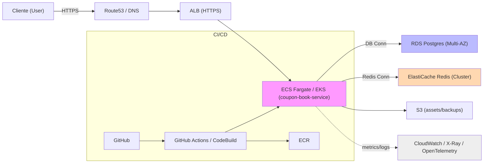

# Diagramas: Arquitectura, Diseño de Base de Datos y Despliegue

Este documento contiene diagramas en Mermaid para visualizar la arquitectura del servicio, el diseño de la base de datos (ERD) y una estrategia de despliegue en AWS.

> Nota: GitHub y VS Code soportan renderizado de Mermaid. Si quieres PNG/SVG exportados comenta y los genero (tarea opcional en la lista).

---

## 1) Diagrama de Arquitectura de Alto Nivel (componentes)

```mermaid
flowchart LR
  Client["Cliente (Web / Mobile / Scripts)"] -->|HTTPS| ALB["ALB / API Gateway"]
  subgraph VPC
    ALB --> API["Service: coupon-book-service (NestJS)"]
    API --> Postgres[(PostgreSQL / RDS)]
    API --> Redis[(Redis / ElastiCache)]
    API --> S3[(S3 / Cloud Storage)]
    API --> Logs["Logs / Tracing (CloudWatch, OTEL)"]
  end

  subgraph CI
    GitHub["Repo (GitHub)"] --> CI["CI (GitHub Actions / CodeBuild)"]
    CI --> ECR["ECR / Registry"]
    ECR --> ALB
  end

  style API fill:#f9f,stroke:#333,stroke-width:1px
  style Postgres fill:#bbf
  style Redis fill:#ffd8b1
```

Leyenda breve:
- `API` representa la aplicación NestJS que expone los endpoints descritos en `docs/ARCHITECTURE_AND_API.md`.
- `Postgres` es la base de datos relacional (TypeORM + migraciones).
- `Redis` se usa para locking distribuido y caches calientes.
- `S3` para backups, assets o cargas masivas de códigos (opcional).
- `ALB / API Gateway` gestiona TLS, rutas y balanceo.

---

## 2) Diagrama de Entidad-Relación (ERD) — Diseño de BD de Alto Nivel



Notas:
- `code` tiene restricción UNIQUE.
- Índices sugeridos: `(coupon_book_id, status)` en `coupon_codes`, `(user_id, coupon_book_id)` en `coupon_redemptions`.

---

## 3) Diagrama de Despliegue (AWS — alto nivel)



Puntos de alta disponibilidad y escalado:
- RDS en Multi-AZ con read-replicas para lecturas pesadas.
- ElastiCache en modo cluster o replication group con réplicas.
- Auto Scaling para tasks/pods basados en métricas (CPU, RPS, latencia).
- ALB con health checks y múltiples AZs.

---

## 4) Diagrama de Secuencia (flujo: lock -> redeem)

```mermaid
sequenceDiagram
  participant Client
  participant API
  participant Redis
  participant Postgres

  Client->>API: POST /api/coupons/:code/lock { userId, ttlSeconds }
  API->>Redis: SET NX lock:coupon:code token EX ttl
  alt acquired
    Redis-->>API: OK
    API->>Postgres: UPDATE coupon_codes SET locked_by, locked_at, lock_expires_at
    API-->>Client: 200 { locked: true, token }
  else locked
    Redis-->>API: existing token
    API-->>Client: 423 { secondsRemaining }
  end

  Client->>API: POST /api/coupons/:code/redeem { userId }
  API->>Redis: GET lock:coupon:code
  alt locked and owner != requestor
    Redis-->>API: token
    API-->>Client: 423 { secondsRemaining }
  else not locked or owner==requestor
    API->>Postgres: SELECT * FROM coupon_codes WHERE code = ?
    API->>Postgres: SELECT COUNT(*) FROM coupon_redemptions WHERE user_id, book_id
    API->>Postgres: BEGIN; SELECT ... FOR UPDATE; INSERT coupon_redemptions; UPDATE coupon_codes; COMMIT
    API-->>Client: 200 { redeemed: true }
  end
```

---

## 5) Cómo usar / renderizar
- En GitHub: los archivos `.md` con bloques Mermaid se renderizan automáticamente en la vista del repo.
- En local: usa la extensión "Markdown Preview Mermaid Support" en VS Code o herramientas CLI como `mmdc` (Mermaid CLI) para exportar a PNG/SVG.

Comandos útiles (ejemplo para exportar con Mermaid CLI si lo quieres):

```bash
# instalar mermaid-cli (requiere Node.js)
npm install -g @mermaid-js/mermaid-cli
# exportar el archivo (ejemplo)
mmdc -i docs/ARCHITECTURE_DIAGRAMS.md -o docs/diagrams/architecture.png
```

---

## 6) Próximos pasos sugeridos
- Revisar los textos/etiquetas y adaptar nombres exactos de servicios/paths a los controladores y DTO del repo (tarea pendiente en la TODO list).
- Si quieres, genero las imágenes (PNG/SVG) y las añado al repo en `docs/diagrams/`.
- Opcional: generar un diagrama C4 más detallado por servicios y actores.

---

Archivo creado: `docs/ARCHITECTURE_DIAGRAMS.md`
